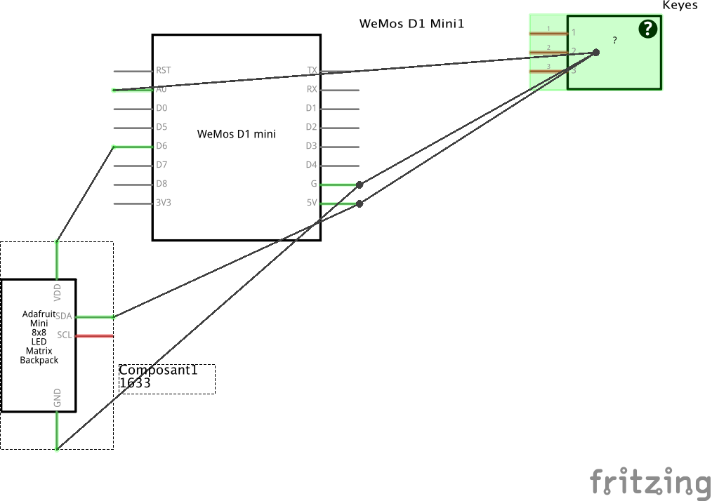

# esgi_SecutityIoT

<h1>PROJET</h1>
Ce projet est dans le cadre de notre semaine thématique sur la Sécurité IoT.  
Le but est de construire un petit circuit qui, via un Broker MQTT tel que Mosquitto, pourrait communiquer avec l'ordinateur de l'utilisateur à l'aide d'une interface web.   

Notre projet est composé de :
 <t>- une Wemos D1 mini
 <t>- un élément composé d'une série de 8 LED auxquelles on peut affecter une couleur RGB
 <t>- un élément KEYES réagissant aux sons émis
  
  
L'interface web permet de manipuler les couleurs et l'éclairage des LED ainsi que le mode de clignotement des LED.

<h1>SCHEMA</h1>

<h1>LANCER</h1>
git init 
git clone https://github.com/NicoK78/esgi_SecutityIoT/ 
(sudo) npm install 

    
